<div align="center">




<br />


[](https://www.linkedin.com/in/gustavo-anderson)
[](mailto:gustavoanderson.me@gmail.com)

<br />

### 🌐 **[English](#-about-me)** · **[Português](#-sobre-mim)**


</div>

## 🧪 About Me

I'm **Gustavo Anderson**, a QA engineer from Curitiba. I've been working in software quality since 2023, testing an online study platform (mock exams and exercise lists) through manual and exploratory testing, and building automated test suites on the side to cover UI, API, mobile and performance.

I came to QA the long way. I spent **7+ years in telecom at multinational companies (Huawei and TIM)** as a project manager in network deployment, where a missed detail meant a site that didn't go live. I also worked in technical support and customer success, handling enterprise accounts at risk of churn. That's where I learned that most bugs are found by customers first, and that's exactly what I want to prevent.

> ### ✅ Find the problem before the customer does, and leave evidence that it was tested.

Today I split my time between three fronts: **test automation** across layers, **quality inside the pipeline** (CI, reports, performance thresholds), and **AI applied to QA**, building agents with Claude to guide QA activities and speed up test automation.

```text
▸ Primary     QA · Test Automation · Cypress · Playwright
▸ Secondary   API & Performance Testing · CI/CD · Mobile (Appium)
▸ Emerging    AI-Assisted QA · Claude Agents · Claude Code
```

<div align="center">

</div>

## 🎯 QA Focus

<table>
<tr>
<td width="33%" valign="top">

### 🖥️ Test Automation

*Covering every layer.*

`UI / E2E` `API REST` `Mobile`
`Page Objects` `Custom Commands`
`Faker` `Fixtures` `Data-driven`
`Contract Testing` `BDD`

</td>
<td width="33%" valign="top">

### ⚙️ Quality in the Pipeline

*Tests that run themselves.*

`GitHub Actions` `Jenkins`
`Allure Reports` `Cypress Cloud`
`Load & Stress Testing`
`Performance Thresholds`
`Evidence & Traceability`

</td>
<td width="33%" valign="top">

### 🤖 AI for Quality

*Agents that help QA think.*

`Claude Code` `AI Agents`
`Test Design with AI`
`QA Skills & Guidance`
`Human Review`

</td>
</tr>
</table>

<div align="center">

</div>

## 🧬 Tech Stack

<div align="center">

#### 🧪 Testing


#### 📊 Reports, CI & Cloud


#### 💻 Languages & Tools


</div>

<div align="center">

</div>

## 🗂️ QA Portfolio

<div align="center">


</div>

### ⭐ Highlights

| Project | What I did | Result |
|---|---|---|
| 🧪 [**qa-automation-lab**](https://github.com/gustavoanderson/qa-automation-lab) | Built an app with quality from day one: code guards, logic tests, manual, E2E, accessibility, mobile and CI | **22/22** E2E · **17/17** logic · **11/11** manual · **4/4** viewports |
| ⚙️ [**ci-cd-github-actions**](https://github.com/gustavoanderson/ci-cd-github-actions) | Cypress and Playwright running in parallel, one unified Allure report published on GitHub Pages | **126/126** tests passing · [live report ↗](https://gustavoanderson.github.io/ci-cd-github-actions/) |
| ⚡ [**hub-de-leitura-teste-de-carga-k6**](https://github.com/gustavoanderson/hub-de-leitura-teste-de-carga-k6) | Load and stress tests from 2 to 80 concurrent users with thresholds | **0%** errors · found the **bcrypt bottleneck** (p95 16× slower at peak) |

### 🖥️ UI / E2E

| Project | What I did | Result |
|---|---|---|
| [cypress-lists](https://github.com/gustavoanderson/cypress-lists) | 5 user journeys of a book platform, one scenario in 4 maturity levels up to Page Object | **23** scenarios · videos + Cypress Cloud |
| [testing-lojaebac-ui-with-cypress-and-faker](https://github.com/gustavoanderson/testing-lojaebac-ui-with-cypress-and-faker) | Sign-up, login, account and cart on a live WooCommerce store, with Faker | **14** scenarios · negative auth tests |
| [cypress-e2e-test-ecommerceshop](https://github.com/gustavoanderson/cypress-e2e-test-ecommerceshop) | Full purchase journey, from login to "order received" | **7-step** end-to-end flow |
| [hub-de-leitura-cypress-ui](https://github.com/gustavoanderson/hub-de-leitura-cypress-ui) | Contact form validation, one required field per test | **4/4** required fields covered |

### 🔌 API

| Project | What I did | Result |
|---|---|---|
| [teste-api-serverest-cypress-jenkins](https://github.com/gustavoanderson/teste-api-serverest-cypress-jenkins) | REST API tests with Joi contract validation, running in a Jenkins pipeline | **13** scenarios · CRUD **4/4** methods |
| [hub-de-leitura-testando-api](https://github.com/gustavoanderson/hub-de-leitura-testando-api) | Full user CRUD with token auth and self-created test data | **9** scenarios · negative validation |
| [postman-serverest](https://github.com/gustavoanderson/postman-serverest) | Postman collection with automatic token capture | **8** requests · **6** assertions |

### 📱 Mobile · 🥒 BDD

| Project | What I did | Result |
|---|---|---|
| [saucelab-appium-mobiletest](https://github.com/gustavoanderson/saucelab-appium-mobiletest) | Android app login on a Sauce Labs cloud device, Page Objects and Allure | **3/3** runs passing · screenshot evidence |
| [practicing-with-Gherkin](https://github.com/gustavoanderson/practicing-with-Gherkin) | BDD specs for login, product and checkout, with equivalence partitioning | **10** scenarios · **7** error cases |

<div align="center">

</div>

## 🤖 Building with AI — DevLingo

[](https://github.com/gustavoanderson/DevLingo)
[](https://github.com/gustavoanderson/DevLingo/releases)


> **A Duolingo-style app to learn programming in Portuguese, on Android and in the browser.**

I built it with Claude Code to keep practicing software development on the go (bus, subway, a ride). Short lessons, an AI-powered mascot and Python scripts that validate the lesson content.

<p align="center">
  
</p>

<div align="center">

</div>

## 🧩 How I Test

```text
Negative scenarios        >  happy path only
Response time             >  status 200
Contract validation       >  assumed structure
Tests in the pipeline     >  manual retesting
Evidence and reports      >  "it works on my machine"
Clear acceptance criteria >  vague requirements
One failure, one cause    >  tests that hide the problem
```

## 📊 GitHub Activity

<div align="center">


</div>

<div align="center">


# 🇧🇷 Sobre mim

</div>

Sou o **Gustavo Anderson**, engenheiro de QA de Curitiba. Trabalho com qualidade de software desde 2023, testando uma plataforma de estudos online (simulados e listas de exercícios) com testes manuais e exploratórios, e construo suítes de testes automatizados cobrindo interface, API, mobile e performance.

Cheguei ao QA pelo caminho longo. Foram **mais de 7 anos em multinacionais de telecom (Huawei e TIM)** como gerente de projetos de implantação de rede, onde um detalhe esquecido significava um site que não entrava no ar. Também atuei em suporte técnico e customer success, cuidando de contas enterprise com risco de cancelamento. Foi ali que aprendi que a maioria dos bugs é encontrada primeiro pelo cliente, e é exatamente isso que quero evitar.

> ### ✅ Encontrar o problema antes do cliente, e deixar evidência de que foi testado.

Hoje divido meu tempo entre três frentes: **automação de testes** em todas as camadas, **qualidade dentro do pipeline** (CI, relatórios, critérios de performance) e **IA aplicada ao QA**, construindo agentes com o Claude para orientar atividades de QA e acelerar a automação.

```text
▸ Principal      QA · Automação de Testes · Cypress · Playwright
▸ Secundário     Testes de API e Performance · CI/CD · Mobile (Appium)
▸ Em evolução    QA assistido por IA · Agentes com Claude · Claude Code
```

## 🗂️ Portfólio de QA

| Tipo | Projetos | Destaque |
|---|---|---|
| 🧪 Qualidade de ponta a ponta | [qa-automation-lab](https://github.com/gustavoanderson/qa-automation-lab) | **22/22** E2E, **17/17** lógica, acessibilidade e mobile |
| ⚙️ CI/CD | [ci-cd-github-actions](https://github.com/gustavoanderson/ci-cd-github-actions) | **126/126** testes, Cypress + Playwright, Allure no GitHub Pages |
| ⚡ Performance | [hub-de-leitura-teste-de-carga-k6](https://github.com/gustavoanderson/hub-de-leitura-teste-de-carga-k6) | Até **80 usuários**, **0%** de erro, gargalo identificado |
| 🖥️ UI / E2E | [cypress-lists](https://github.com/gustavoanderson/cypress-lists) · [testing-lojaebac](https://github.com/gustavoanderson/testing-lojaebac-ui-with-cypress-and-faker) · [ecommerceshop](https://github.com/gustavoanderson/cypress-e2e-test-ecommerceshop) · [hub-de-leitura-cypress-ui](https://github.com/gustavoanderson/hub-de-leitura-cypress-ui) | Page Objects, Faker, Cypress Cloud e jornada de compra completa |
| 🔌 API | [serverest-cypress-jenkins](https://github.com/gustavoanderson/teste-api-serverest-cypress-jenkins) · [hub-de-leitura-testando-api](https://github.com/gustavoanderson/hub-de-leitura-testando-api) · [postman-serverest](https://github.com/gustavoanderson/postman-serverest) | Contrato com Joi, pipeline Jenkins e autenticação por token |
| 📱 Mobile | [saucelab-appium-mobiletest](https://github.com/gustavoanderson/saucelab-appium-mobiletest) | Android na nuvem da Sauce Labs, **3/3** execuções aprovadas |
| 🥒 BDD | [practicing-with-Gherkin](https://github.com/gustavoanderson/practicing-with-Gherkin) | **10** cenários, **7** de erro, particionamento de equivalência |

## 🤖 Construindo com IA — DevLingo

App no estilo Duolingo para aprender programação em português, no Android e no navegador. Construí com o Claude Code para continuar praticando desenvolvimento em qualquer lugar (ônibus, metrô, carona). [Ver repositório ↗](https://github.com/gustavoanderson/DevLingo) · [Baixar ↗](https://github.com/gustavoanderson/DevLingo/releases)

## 🧩 Como eu testo

```text
Cenários negativos        >  só o caminho feliz
Tempo de resposta         >  status 200
Validação de contrato     >  estrutura presumida
Testes no pipeline        >  reteste manual
Evidência e relatório     >  "na minha máquina funciona"
Critério de aceite claro  >  requisito vago
Uma falha, uma causa      >  teste que esconde o problema
```

<div align="center">

## 📬 Vamos conversar

[](https://www.linkedin.com/in/gustavo-anderson)
[](mailto:gustavoanderson.me@gmail.com)
[](https://github.com/gustavoanderson)

**[↑ Back to English](#-about-me)**


</div>
